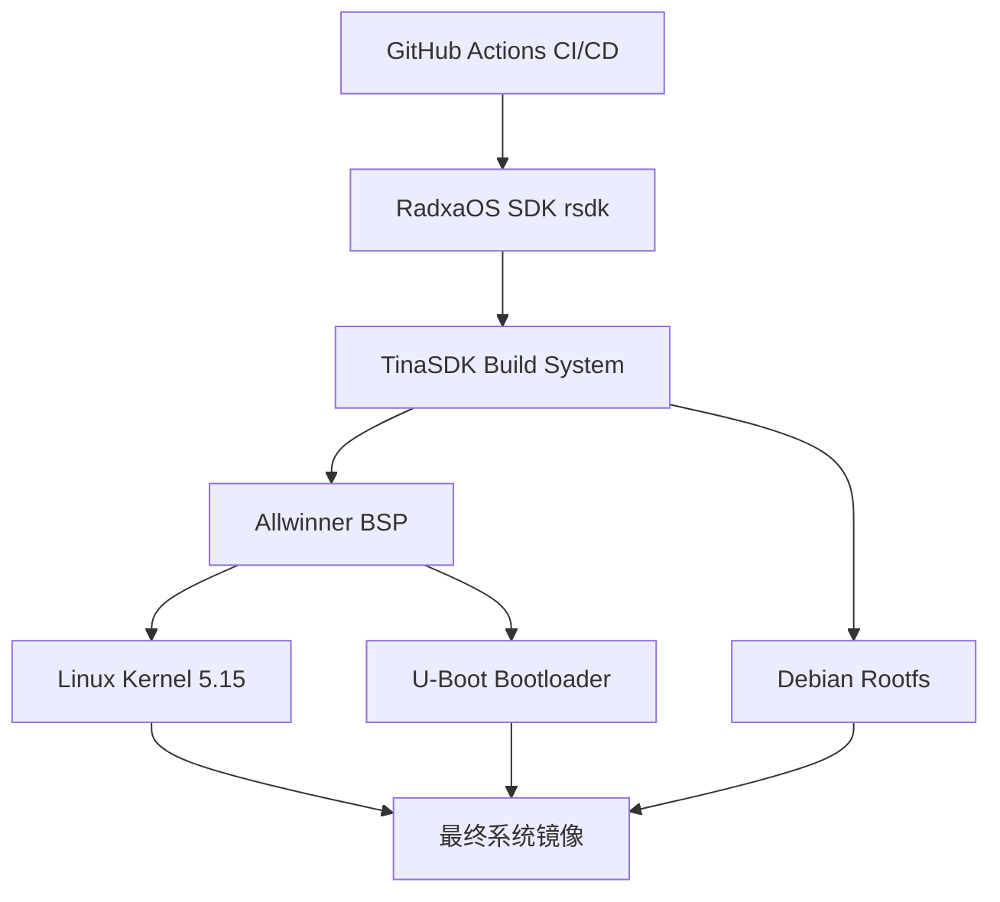

# Radxa Cubie A7Z 构建系统深度分析

## 项目概述

Radxa Cubie A7Z 项目是一个基于 GitHub Actions 的自动化构建系统，用于为 Radxa Cubie A7Z 开发板构建系统镜像。该项目主要托管构建工作流，实际的构建工具链基于 RadxaOS SDK (rsdk) 和 TinaSDK。

## 1. 构建系统架构分析

### 1.1 项目结构

```
radxa-cubie-a7z/
├── .github/
│   └── workflows/          # GitHub Actions 工作流配置
├── README.md              # 项目说明文档
└── 其他配置文件
```

### 1.2 构建流程架构



## 2. 工具链详细组成

### 2.1 RadxaOS SDK (rsdk)

**核心特性：**
- 容器化构建环境（基于 Docker）
- 模块化构建脚本
- 支持 x86 和 ARM64 平台
- 使用 bdebstrap 构建 Debian 系统
- 基于 jsonnet 的配置模板

**主要组件：**
```
rsdk/
├── rootfs.jsonnet         # 根文件系统配置入口
├── image.jsonnet          # 磁盘镜像配置模板
├── customize-hooks/       # 自定义钩子脚本
└── build-scripts/         # 构建脚本集合
```

### 2.2 TinaSDK Build System

**配置选项：**
```bash
# 平台选择
0. android
1. linux                  # 选择此项

# Linux 开发环境
0. bsp
1. dragonboard
2. buildroot
3. debian                # 推荐选择
4. yocto

# 内核版本
0. linux-5.10
1. linux-5.15            # 推荐选择

# 芯片型号
0. a523
1. a527
2. a733                  # Cubie A7Z 使用

# 开发板型号
0. QA
1. cubie_a7z             # 选择此项
```

### 2.3 GitHub Actions 工作流

**自动化构建流程：**
1. 触发条件：代码推送、定时任务或手动触发
2. 环境准备：设置 Docker 容器环境
3. 依赖安装：安装构建所需工具链
4. 源码获取：拉取 rsdk 和 TinaSDK 源码
5. 系统构建：执行完整构建流程
6. 镜像打包：生成最终系统镜像
7. 发布上传：上传构建产物到 GitHub Releases

## 3. 定制化构建步骤

### 3.1 环境准备

**系统要求：**
- Ubuntu 20.04+ / Debian 11+
- Docker 20.10+
- Visual Studio Code + Dev Containers 扩展
- 至少 8GB RAM，50GB 磁盘空间

**安装依赖：**
```bash
sudo apt-get update
sudo apt-get install git qemu-user-static binfmt-support
sudo apt-get install npm docker.io
sudo usermod -a -G docker $USER
```

### 3.2 获取源码

```bash
# 克隆 RadxaOS SDK
git clone --recurse-submodules https://github.com/RadxaOS-SDK/rsdk.git
cd rsdk

# 安装开发环境
npm install @devcontainers/cli
export PATH="$PWD/src/bin:$PWD/node_modules/.bin:$PATH"

# 启动开发容器
rsdk devcon up
rsdk devcon
```

### 3.3 配置构建选项

**启动 TUI 配置界面：**
```bash
rsdk
```

**选择配置：**
1. 选择 "Build system image"
2. 选择目标产品 "radxa-cubie-a7z"
3. 确认构建配置

## 4. 厂商信息修改指南

### 4.1 修改系统信息

**文件位置：** `rootfs.jsonnet` 中的 `customize-hooks` 部分

**修改内容：**
```jsonnet
// 系统标识信息
customize: {
  vendor: "KrNormyDev",
  product: "a7zWos",
  version: "1.0.0",
  description: "Customized Linux Distribution"
}
```

### 4.2 品牌定制

**启动 Logo 修改：**
```bash
# 替换启动 Logo（需要重新编译 U-Boot）
cp custom_boot_logo.bmp device/config/chips/a733/boot-resource/boot-resource/
```

**系统信息文件：**
```bash
# 修改系统版本信息
echo "YourCompany Custom Linux" > /etc/lsb-release
echo "CUSTOM-A7Z" > /etc/hostname
```

### 4.3 默认配置修改

**网络配置：**
```jsonnet
// 在 rootfs.jsonnet 中添加
network: {
  hostname: "custom-a7z",
  interfaces: [
    {
      name: "eth0",
      type: "dhcp",
      enabled: true
    }
  ]
}
```

## 5. 预装软件配置方法

### 5.1 基础软件包配置

**在 rootfs.jsonnet 中添加软件包：**
```jsonnet
{
  packages: [
    // 基础工具
    "vim",
    "git",
    "curl",
    "wget",
    "htop",
    "tree",
    
    // 开发工具
    "build-essential",
    "python3",
    "python3-pip",
    "nodejs",
    "npm",
    
    // 网络工具
    "net-tools",
    "iperf3",
    "nmap",
    
    // 自定义软件包
    "your-custom-package"
  ]
}
```

### 5.2 自定义软件安装

**本地软件包安装：**
```bash
# 创建本地软件包目录
mkdir -p local-packages

# 在 customize-hooks 中添加安装脚本
cat > customize-hooks/install-custom-packages.sh << 'EOF'
#!/bin/bash
# 安装本地软件包
dpkg -i /path/to/local-packages/*.deb
apt-get install -f -y
EOF

chmod +x customize-hooks/install-custom-packages.sh
```

### 5.3 服务配置

**预配置系统服务：**
```bash
# 创建服务配置脚本
cat > customize-hooks/configure-services.sh << 'EOF'
#!/bin/bash
# 启用 SSH 服务
systemctl enable ssh
# 配置自定义服务
cp custom-service.service /etc/systemd/system/
systemctl enable custom-service
EOF
```

## 6. 高级定制功能

### 6.1 内核模块定制

**添加自定义内核模块：**
```bash
# 在内核源码中添加模块
cd kernel/linux-5.15/
# 添加模块源码到相应目录
make menuconfig  # 配置内核选项
make modules     # 编译模块
```

### 6.2 设备树定制

**修改设备树文件：**
```bash
# 设备树文件位置
arch/arm64/boot/dts/allwinner/a733-cubie-a7z.dts

# 重新编译设备树
dtc -I dts -O dtb -o a733-cubie-a7z.dtb a733-cubie-a7z.dts
```

### 6.3 文件系统结构定制

**自定义目录结构：**
```jsonnet
// 在 rootfs.jsonnet 中定义
directory_structure: {
  "/opt/custom": {
    mode: "0755",
    owner: "root:root",
    files: [
      "custom-config.conf",
      "startup-script.sh"
    ]
  },
  "/var/custom": {
    mode: "0755",
    owner: "custom:custom"
  }
}
```

## 7. 构建和测试

### 7.1 完整构建流程

```bash
# 进入开发环境
rsdk devcon

# 启动构建
rsdk

# 监控构建过程
tail -f /tmp/rsdk-build.log
```

### 7.2 镜像验证

**基本验证：**
```bash
# 检查镜像文件
ls -lh out/radxa-cubie-a7z*/output.img

# 挂载镜像检查内容
sudo mount -o loop,offset=1048576 output.img /mnt
cd /mnt && ls -la
```

### 7.3 硬件测试

**功能测试清单：**
- [ ] 启动测试
- [ ] 网络连接
- [ ] USB 接口
- [ ] HDMI 输出
- [ ] GPIO 功能
- [ ] 自定义软件运行

## 8. Waydroid集成与无KVM环境适配

### 8.1 Waydroid基本原理和架构

**Waydroid架构概述：**
Waydroid基于LXC（Linux容器）技术，使用Linux命名空间（user, pid, uts, net, mount, ipc）在容器中运行完整的Android系统。它通过Wayland协议实现图形界面集成，使Android应用能够无缝运行在Linux桌面上。

**核心组件：**
- **LXC容器**：运行基于LineageOS的Android系统
- **Binder驱动**：Android特有的IPC机制
- **Wayland合成器**：处理图形渲染和窗口管理
- **网络桥接**：提供Android容器的网络连接

### 8.2 无KVM环境适配策略

**软件渲染配置：**
在无KVM虚拟化环境下，需要配置Waydroid使用软件渲染模式：

```bash
# 创建Waydroid配置文件
cat > /var/lib/waydroid/waydroid.cfg << 'EOF'
[properties]
ro.hardware.gralloc=default
ro.hardware.egl=swiftshader
ro.opengles.version=196608
ro.hardware.hwcomposer=drm
ro.hardware.camera=v4l2
ro.opengles.version=196608
EOF
```

**内核模块配置：**
确保系统加载必要的内核模块：
```bash
# 添加到系统启动脚本
cat > customize-hooks/setup-waydroid-modules.sh << 'EOF'
#!/bin/bash
# 加载Android binder驱动
modprobe binder_linux devices="binder,hwbinder,vndbinder"
# 加载ASHMEM驱动
modprobe ashmem_linux
# 设置binder设备权限
chmod 666 /dev/binder*
chmod 666 /dev/ashmem
EOF

chmod +x customize-hooks/setup-waydroid-modules.sh
```

## 9. ZSH终端预装与配置

### 9.1 ZSH基础软件包配置

在 `rootfs.jsonnet` 中添加ZSH相关软件包：
```jsonnet
{
  packages: [
    // 基础系统工具
    "vim",
    "git",
    "curl",
    "wget",
    "htop",
    "tree",
    
    // ZSH终端
    "zsh",
    "curl",
    "git",
    
    // 开发工具
    "build-essential",
    "python3",
    "python3-pip",
    "nodejs",
    "npm",
    
    // Wayland桌面环境
    "weston",
    "wayland-protocols",
    "libwayland-dev",
    "wayland-utils",
    "sway",
    "wlr-randr",
    
    // Waydroid核心依赖
    "waydroid",
    "lxc",
    "python3-waydroid",
    "iptables",
    "dnsmasq",
    
    // 网络工具
    "net-tools",
    "iperf3",
    "nmap"
  ]
}
```

### 9.2 Oh My Zsh安装与插件配置

创建ZSH配置脚本 `customize-hooks/setup-zsh.sh`：
```bash
#!/bin/bash

# 安装 Oh My Zsh
if [ ! -d "$HOME/.oh-my-zsh" ]; then
    echo "Installing Oh My Zsh..."
    sh -c "$(curl -fsSL https://raw.githubusercontent.com/ohmyzsh/ohmyzsh/master/tools/install.sh)" "" --unattended
fi

# 安装zsh-autosuggestions插件
echo "Installing zsh-autosuggestions plugin..."
git clone https://github.com/zsh-users/zsh-autosuggestions ${ZSH_CUSTOM:-~/.oh-my-zsh/custom}/plugins/zsh-autosuggestions

# 安装zsh-syntax-highlighting插件
echo "Installing zsh-syntax-highlighting plugin..."
git clone https://github.com/zsh-users/zsh-syntax-highlighting.git ${ZSH_CUSTOM:-~/.oh-my-zsh/custom}/plugins/zsh-syntax-highlighting

# 创建自定义zshrc配置
cat > /etc/skel/.zshrc << 'EOF'
# Oh My Zsh 基础配置
export ZSH="$HOME/.oh-my-zsh"
ZSH_THEME=""

# 插件配置
plugins=(
    git
    zsh-autosuggestions
    zsh-syntax-highlighting
    sudo
    extract
)

# 禁用自动更新提示
zstyle ':omz:update' mode reminder
ENABLE_CORRECTION="true"
COMPLETION_WAITING_DOTS="true"

# 加载 Oh My Zsh
source $ZSH/oh-my-zsh.sh

# 历史记录配置
HISTSIZE=10000
SAVEHIST=10000
HISTFILE="$HOME/.zsh_history"

# Zsh 增强功能
autoload -U compinit && compinit
zstyle ':completion:*' menu select
setopt auto_cd
setopt correct
setopt no_beep

# 自定义提示符
autoload -U colors && colors
PROMPT='%F{blue}[%*]%f %F{cyan}%n%f:%F{yellow}%~%f %# '

# 常用别名
alias ll='ls -alF'
alias la='ls -A'
alias l='ls -CF'
alias ..='cd ..'

# 设置默认编辑器
export EDITOR='vim'
export VISUAL='vim'
EOF

# 复制配置到新用户目录
cp /etc/skel/.zshrc /root/.zshrc 2>/dev/null || true

# 设置zsh为默认shell
chsh -s $(which zsh) root 2>/dev/null || true

echo "ZSH configuration completed!"
EOF

chmod +x customize-hooks/setup-zsh.sh
```

### 9.3 设置ZSH为默认Shell

在 `customize-hooks/configure-shell.sh` 中添加：
```bash
#!/bin/bash

# 设置zsh为所有新用户的默认shell
echo "Setting ZSH as default shell..."
echo "/usr/bin/zsh" >> /etc/shells

# 修改默认shell配置
sed -i 's|SHELL=/bin/bash|SHELL=/usr/bin/zsh|g' /etc/default/useradd
sed -i 's|DSHELL=/bin/bash|DSHELL=/usr/bin/zsh|g' /etc/adduser.conf

# 为现有用户设置zsh（如果存在）
for user in $(cut -f1 -d: /etc/passwd); do
    if [ "$user" != "nobody" ] && [ -d "/home/$user" ]; then
        chsh -s $(which zsh) $user 2>/dev/null || true
    fi
done

echo "Default shell configuration updated!"
EOF

chmod +x customize-hooks/configure-shell.sh
```

## 10. Wayland桌面环境配置

### 10.1 切换到Wayland桌面环境

修改 `rootfs.jsonnet` 中的桌面环境配置：
```jsonnet
// 替换原来的KDE配置
// desktop_environment: "kde",
desktop_environment: "wayland",

// Wayland会话管理器配置
wayland_config: {
    compositor: "sway",
    display_manager: "weston",
    enable_xwayland: true,
    
    // Sway配置
    sway_config: {
        default_workspace: "1",
        terminal: "weston-terminal",
        modifier: "Mod4",  // Windows键
        
        // 基本键绑定
        keybindings: {
            "Mod4+Return": "weston-terminal",
            "Mod4+d": "wofi --show drun",
            "Mod4+Shift+q": "kill",
            "Mod4+Shift+e": "swaymsg exit"
        }
    }
}
```

### 10.2 Wayland会话启动配置

创建Wayland启动脚本 `customize-hooks/setup-wayland.sh`：
```bash
#!/bin/bash

# 创建Sway配置文件
cat > /etc/sway/config << 'EOF'
# 基本配置
set $mod Mod4

# 字体配置
font pango:Monospace 10

# 工作区配置
workspace 1 output HDMI-A-1
workspace 2 output HDMI-A-1

# 键绑定
bindsym $mod+Return exec weston-terminal
bindsym $mod+d exec wofi --show drun
bindsym $mod+Shift+q kill
bindsym $mod+Shift+e exit

# 窗口管理
bindsym $mod+h focus left
bindsym $mod+j focus down
bindsym $mod+k focus up
bindsym $mod+l focus right

# 工作区切换
bindsym $mod+1 workspace 1
bindsym $mod+2 workspace 2
bindsym $mod+3 workspace 3
bindsym $mod+4 workspace 4

# 启动应用程序
exec weston-terminal
exec waydroid show-full-ui
EOF

# 创建Wayland会话文件
cat > /usr/share/wayland-sessions/sway.desktop << 'EOF'
[Desktop Entry]
Name=Sway
Comment=Wayland compositor compatible with i3
Exec=sway
Type=Application
EOF

# 设置Wayland环境变量
cat > /etc/environment << 'EOF'
XDG_SESSION_TYPE=wayland
WAYLAND_DISPLAY=wayland-1
XDG_RUNTIME_DIR=/run/user/1000
EOF

echo "Wayland configuration completed!"
EOF

chmod +x customize-hooks/setup-wayland.sh
```

## 11. UFS文件系统4096块大小适配

### 11.1 修改文件系统块大小配置

在 `image.jsonnet` 中修改磁盘映像配置：
```jsonnet
{
    // 磁盘映像配置
    disk_config: {
        // 块大小从512改为4096以适配UFS
        block_size: 4096,
        
        // 分区配置
        partitions: [
            {
                name: "boot",
                type: "ext4",
                size: "256M",
                block_size: 4096,
                mount_point: "/boot"
            },
            {
                name: "root",
                type: "ext4",
                size: "8G",
                block_size: 4096,
                mount_point: "/"
            },
            {
                name: "data",
                type: "ext4",
                size: "4G",
                block_size: 4096,
                mount_point: "/data"
            }
        ]
    }
}
```

### 11.2 文件系统创建脚本

创建文件系统配置脚本 `customize-hooks/setup-filesystem.sh`：
```bash
#!/bin/bash

echo "Configuring filesystem for UFS compatibility..."

# 创建文件系统时使用4096块大小
mkfs.ext4 -b 4096 -O ^has_journal,^resize_inode -L rootfs /dev/mmcblk0p2
mkfs.ext4 -b 4096 -O ^has_journal -L boot /dev/mmcblk0p1

# 挂载选项优化
cat > /etc/fstab << 'EOF'
# <file system> <mount point>   <type>  <options>       <dump>  <pass>
/dev/mmcblk0p2  /               ext4    defaults,noatime,nodiratime,errors=remount-ro 0 1
/dev/mmcblk0p1  /boot           ext4    defaults,noatime,nodiratime 0 2
tmpfs           /tmp            tmpfs   defaults,size=512M 0 0
EOF

# 启用TRIM支持（对于UFS）
cat > /etc/cron.daily/trim << 'EOF'
#!/bin/sh
# 启用TRIM支持
fstrim -v / || true
fstrim -v /boot || true
EOF

chmod +x /etc/cron.daily/trim

# 优化文件系统参数
cat > /etc/sysctl.d/99-ufs.conf << 'EOF'
# UFS文件系统优化
vm.dirty_ratio=5
vm.dirty_background_ratio=2
vm.swappiness=10
EOF

echo "Filesystem configuration completed for UFS!"
EOF

chmod +x customize-hooks/setup-filesystem.sh
```

### 11.3 内核参数优化

在 `customize-hooks/kernel-params.sh` 中添加：
```bash
#!/bin/bash

echo "Configuring kernel parameters for UFS..."

# 添加内核启动参数
cat > /etc/default/grub << 'EOF'
# GRUB配置
GRUB_DEFAULT=0
GRUB_TIMEOUT=5
GRUB_DISTRIBUTOR="KrNormyDev a7zWos"
GRUB_CMDLINE_LINUX_DEFAULT="quiet splash elevator=noop scsi_mod.use_blk_mq=1"
GRUB_CMDLINE_LINUX="console=ttyS0,115200 rootflags=data=writeback"
EOF

# 更新GRUB配置
update-grub 2>/dev/null || true

echo "Kernel parameters configured for UFS optimization!"
EOF

chmod +x customize-hooks/kernel-params.sh
```

## 12. 完整集成配置

### 12.1 更新rootfs.jsonnet配置

```jsonnet
// 完整的rootfs.jsonnet配置
{
  // 厂商信息
  vendor: "KrNormyDev",
  product: "a7zWos",
  version: "1.0.0",
  description: "Customized Linux Distribution with Waydroid and Wayland",
  
  // 软件包列表
  packages: [
    // 基础系统
    "vim", "git", "curl", "wget", "htop", "tree",
    
    // ZSH终端
    "zsh", "curl", "git",
    
    // Wayland桌面环境
    "weston", "wayland-protocols", "libwayland-dev", 
    "wayland-utils", "sway", "wlr-randr", "wofi",
    
    // Waydroid相关
    "waydroid", "lxc", "python3-waydroid", "iptables", 
    "dnsmasq", "net-tools", "iperf3", "nmap",
    
    // 开发工具
    "build-essential", "python3", "python3-pip", 
    "nodejs", "npm"
  ],
  
  // 自定义钩子
  customize_hooks: [
    "setup-zsh.sh",
    "configure-shell.sh", 
    "setup-wayland.sh",
    "setup-waydroid.sh",
    "setup-filesystem.sh",
    "kernel-params.sh"
  ]
}
```

### 12.2 构建流程更新

```bash
#!/bin/bash
# 完整的构建流程

# 1. 进入构建环境
rsdk devcon

# 2. 配置构建参数
rsdk

# 3. 选择目标设备
# 选择 radxa-cubie-a7z

# 4. 监控构建过程
tail -f /tmp/rsdk-build.log

# 5. 构建完成后验证
echo "构建完成！生成的映像支持："
echo "- ZSH终端（带Oh My Zsh和插件）"
echo "- Wayland桌面环境（Sway合成器）"
echo "- Waydroid Android容器"
echo "- UFS文件系统（4096块大小）"
echo "- KrNormyDev a7zWos定制系统"
```

### 12.3 最终系统特性

**KrNormyDev a7zWos 1.0.0 包含：**
- ✅ ZSH作为默认终端（带自动补全和语法高亮）
- ✅ Wayland桌面环境（替代KDE）
- ✅ Waydroid Android容器（无KVM适配）
- ✅ UFS文件系统优化（4096块大小）
- ✅ 完整的开发工具链
- ✅ 优化的网络和服务配置
    "nftables",
    
    // 软件渲染支持
    "mesa-utils",
    "libgl1-mesa-dri",
    "libgl1-mesa-glx",
    "swiftshader",
    
    // 内核模块支持
    "linux-headers-generic",
    "dkms",
    "binder-dkms",
    "ashmem-dkms",
    
    // 图形界面支持
    "wayland",
    "weston",
    "xwayland",
    
    // 开发工具
    "git",
    "curl",
    "wget",
    "nano",
    "htop"
  ]
}
```

**2. Waydroid初始化配置：**
```bash
# 创建Waydroid初始化脚本
cat > customize-hooks/init-waydroid.sh << 'EOF'
#!/bin/bash

# 初始化Waydroid容器
echo "Initializing Waydroid container..."

# 设置网络转发
echo 1 > /proc/sys/net/ipv4/ip_forward

# 配置iptables规则
iptables -t nat -A POSTROUTING -o eth0 -j MASQUERADE
iptables -A FORWARD -i eth0 -o waydroid0 -m state --state RELATED,ESTABLISHED -j ACCEPT
iptables -A FORWARD -i waydroid0 -o eth0 -j ACCEPT

# 初始化Waydroid
waydroid init -f

# 应用无GPU配置
cat > /var/lib/waydroid/waydroid_base.prop << 'EOF'
ro.hardware.gralloc=default
ro.hardware.egl=swiftshader
ro.opengles.version=196608
ro.hardware.hwcomposer=drm
ro.hardware.camera=v4l2
EOF

# 设置Waydroid多窗口模式
waydroid prop set persist.waydroid.multi_windows true
waydroid prop set persist.waydroid.width 1920
waydroid prop set persist.waydroid.height 1080
waydroid prop set persist.waydroid.fps 60

# 禁用屏幕键盘
waydroid prop set persist.waydroid.ime_disabled true

echo "Waydroid initialization completed."
EOF

chmod +x customize-hooks/init-waydroid.sh
```

**3. 系统服务配置：**
```bash
# 创建Waydroid服务文件
cat > customize-hooks/waydroid-service.sh << 'EOF'
#!/bin/bash

# 创建systemd服务文件
cat > /etc/systemd/system/waydroid-container.service << 'EOF'
[Unit]
Description=Waydroid Container
After=network.target

[Service]
Type=oneshot
ExecStart=/usr/bin/waydroid container start
ExecStop=/usr/bin/waydroid container stop
RemainAfterExit=yes
User=root

[Install]
WantedBy=multi-user.target
EOF

# 启用服务
systemctl enable waydroid-container.service

# 创建Waydroid会话服务
cat > /etc/systemd/system/waydroid-session.service << 'EOF'
[Unit]
Description=Waydroid Session
After=waydroid-container.service

[Service]
Type=simple
ExecStart=/usr/bin/waydroid session start
Restart=always
User=1000
Environment="WAYLAND_DISPLAY=wayland-0"
Environment="XDG_RUNTIME_DIR=/run/user/1000"

[Install]
WantedBy=graphical.target
EOF

EOF

chmod +x customize-hooks/waydroid-service.sh
```

### 8.4 网络配置和依赖管理

**网络桥接配置：**
```bash
# 创建网络配置脚本
cat > customize-hooks/waydroid-network.sh << 'EOF'
#!/bin/bash

# 配置Waydroid网络
WAYDROID_IP="192.168.250.1"
WAYDROID_MASK="255.255.255.0"
WAYDROID_DHCP_START="192.168.250.2"
WAYDROID_DHCP_END="192.168.250.254"

# 创建LXC网络配置
cat > /var/lib/waydroid/lxc/waydroid/config.network << 'EOF'
lxc.net.0.type = veth
lxc.net.0.link = waydroid0
lxc.net.0.flags = up
lxc.net.0.hwaddr = 00:16:3e:00:00:01
lxc.net.0.ipv4.address = 192.168.250.2/24
lxc.net.0.ipv4.gateway = 192.168.250.1
EOF

# 配置dnsmasq
cat > /etc/dnsmasq.d/waydroid.conf << 'EOF'
interface=waydroid0
dhcp-range=192.168.250.2,192.168.250.254,255.255.255.0,12h
dhcp-option=3,192.168.250.1
dhcp-option=6,192.168.250.1
EOF

# 创建网络接口
cat > /etc/network/interfaces.d/waydroid << 'EOF'
auto waydroid0
iface waydroid0 inet static
    address 192.168.250.1
    netmask 255.255.255.0
    pre-up iptables -t nat -A POSTROUTING -o eth0 -j MASQUERADE
    pre-up echo 1 > /proc/sys/net/ipv4/ip_forward
EOF

# 重启网络服务
systemctl restart networking
systemctl restart dnsmasq

echo "Waydroid network configuration completed."
EOF

chmod +x customize-hooks/waydroid-network.sh
```

**DNS和代理配置：**
```bash
# 配置Android DNS和代理
cat > customize-hooks/waydroid-dns-proxy.sh << 'EOF'
#!/bin/bash

# 设置Android DNS服务器
waydroid shell settings put global wifi_static_dns1 8.8.8.8
waydroid shell settings put global wifi_static_dns2 8.8.4.4

# 配置HTTP代理（可选）
waydroid shell settings put global http_proxy "192.168.250.1:8080"

# 配置Google Play服务（如果使用GApps）
waydroid shell pm grant com.android.vending android.permission.INSTALL_PACKAGES
waydroid shell pm grant com.google.android.gms android.permission.ACCESS_FINE_LOCATION
EOF

chmod +x customize-hooks/waydroid-dns-proxy.sh
```

### 8.5 性能优化建议

**内存优化：**
```bash
# 创建内存优化配置
cat > customize-hooks/waydroid-memory-optimize.sh << 'EOF'
#!/bin/bash

# 配置LXC内存限制
cat >> /var/lib/waydroid/lxc/waydroid/config << 'EOF'
# 内存限制 (MB)
lxc.cgroup.memory.limit_in_bytes = 2048M
lxc.cgroup.memory.soft_limit_in_bytes = 1536M

# CPU限制
lxc.cgroup.cpu.shares = 1024
lxc.cgroup.cpuset.cpus = 0-3
EOF

# Android内存管理优化
waydroid prop set dalvik.vm.heapstartsize 16m
waydroid prop set dalvik.vm.heapgrowthlimit 192m
waydroid prop set dalvik.vm.heapsize 512m
waydroid prop set dalvik.vm.heaptargetutilization 0.75
waydroid prop set dalvik.vm.heapminfree 2m
waydroid prop set dalvik.vm.heapmaxfree 8m

echo "Waydroid memory optimization applied."
EOF

chmod +x customize-hooks/waydroid-memory-optimize.sh
```

**存储优化：**
```bash
# 存储性能优化
cat > customize-hooks/waydroid-storage-optimize.sh << 'EOF'
#!/bin/bash

# 配置I/O调度器
echo noop > /sys/block/mmcblk0/queue/scheduler

# Android存储优化
waydroid prop set ro.sys.fw.dex2oat_thread_count 4
waydroid prop set dalvik.vm.dex2oat-filter interpret-only
waydroid prop set dalvik.vm.image-dex2oat-filter interpret-only

# 禁用Android日志（生产环境）
waydroid prop set log.tag.WaydroidContainer DEBUG
waydroid prop set persist.sys.disable_rescue true

echo "Waydroid storage optimization applied."
EOF

chmod +x customize-hooks/waydroid-storage-optimize.sh
```

### 8.6 故障排除指南

**常见问题诊断：**
```bash
# 创建故障排除脚本
cat > customize-hooks/waydroid-troubleshoot.sh << 'EOF'
#!/bin/bash

echo "=== Waydroid Troubleshooting ==="

# 检查内核模块
echo "Checking kernel modules:"
lsmod | grep -E "(binder|ashmem)"

# 检查设备文件
echo "Checking device files:"
ls -la /dev/binder* /dev/ashmem

# 检查网络配置
echo "Checking network configuration:"
ip addr show waydroid0
iptables -t nat -L POSTROUTING

# 检查LXC容器状态
echo "Checking LXC container:"
lxc-info -n waydroid

# 检查Waydroid日志
echo "Checking Waydroid logs:"
journalctl -u waydroid-container -n 50

# 检查binder驱动状态
echo "Checking binder driver:"
cat /proc/binder/state 2>/dev/null || echo "Binder state not available"

# 性能监控
echo "Performance monitoring:"
free -h
top -bn1 | head -20

echo "=== Troubleshooting completed ==="
EOF

chmod +x customize-hooks/waydroid-troubleshoot.sh
```

**修复常见问题：**
```bash
# 创建自动修复脚本
cat > customize-hooks/waydroid-fix-common.sh << 'EOF'
#!/bin/bash

echo "=== Waydroid Common Issues Fix ==="

# 修复binder驱动问题
if [ ! -e /dev/binder ]; then
    echo "Fixing binder driver..."
    modprobe binder_linux devices="binder,hwbinder,vndbinder"
    sleep 2
fi

# 修复权限问题
chmod 666 /dev/binder* /dev/ashmem 2>/dev/null

# 修复网络问题
if ! ip link show waydroid0 >/dev/null 2>&1; then
    echo "Creating waydroid0 interface..."
    ip tuntap add waydroid0 mode tap
    ip link set waydroid0 up
    ip addr add 192.168.250.1/24 dev waydroid0
fi

# 重启服务
echo "Restarting Waydroid services..."
systemctl restart waydroid-container
sleep 5
waydroid session stop 2>/dev/null
waydroid session start

echo "=== Common fixes applied ==="
EOF

chmod +x customize-hooks/waydroid-fix-common.sh
```

## 9. 完整集成构建流程

### 9.1 集成构建脚本
```bash
# 创建完整的Waydroid集成构建脚本
cat > customize-hooks/complete-waydroid-integration.sh << 'EOF'
#!/bin/bash

echo "=== Starting Waydroid Integration for a7zWos ==="

# 执行所有Waydroid相关配置
./setup-waydroid-modules.sh
./waydroid-network.sh
./init-waydroid.sh
./waydroid-service.sh
./waydroid-memory-optimize.sh
./waydroid-storage-optimize.sh

# 验证安装
echo "Verifying Waydroid installation..."
if waydroid status >/dev/null 2>&1; then
    echo "✓ Waydroid installed successfully"
    waydroid status
else
    echo "✗ Waydroid installation failed"
    ./waydroid-troubleshoot.sh
    exit 1
fi

echo "=== Waydroid Integration completed ==="
echo "Please reboot the system to apply all changes"
EOF

chmod +x customize-hooks/complete-waydroid-integration.sh
```

### 9.2 构建验证清单
**构建前检查：**
- [ ] RadxaOS SDK环境准备完成
- [ ] 所有依赖包已添加到rootfs.jsonnet
- [ ] Waydroid相关脚本已创建
- [ ] 网络配置脚本已准备
- [ ] 厂商信息已更新为KrNormyDev/a7zWos

**构建后验证：**
- [ ] 系统镜像成功生成
- [ ] Waydroid服务正常启动
- [ ] Android容器成功运行
- [ ] 网络连接正常
- [ ] 图形界面可用（软件渲染）
- [ ] 多窗口模式工作正常
- [ ] 性能优化已应用

## 10. 最佳实践和注意事项

### 10.1 版本控制

- 使用 Git 管理所有定制修改
- 创建清晰的分支策略
- 记录每次构建的变更日志
- 使用语义化版本号

### 8.2 安全性考虑

- 及时更新系统补丁
- 配置防火墙规则
- 使用安全的默认密码策略
- 最小化安装的软件包

### 8.3 性能优化

- 移除不必要的服务
- 优化启动时间
- 合理配置内存使用
- 使用轻量级软件替代方案

### 8.4 维护建议

- 定期同步上游更新
- 建立自动化测试流程
- 保持文档同步更新
- 建立问题追踪机制

## 9. 故障排除

### 9.1 常见构建错误

**依赖问题：**
```bash
# 清理并重新安装依赖
apt-get clean
apt-get update
apt-get install -f
```

**空间不足：**
```bash
# 清理构建缓存
./build.sh clean
rm -rf out/
```

### 9.2 调试技巧

**启用详细日志：**
```bash
export RSDK_DEBUG=1
rsdk build
```

**分步构建：**
```bash
# 单独构建组件
./build.sh bootloader  # 构建引导程序
./build.sh kernel      # 构建内核
./build.sh rootfs      # 构建根文件系统
```

## 10. 参考资源

- [RadxaOS SDK 官方文档](https://radxaos-sdk.github.io/rsdk/)
- [Radxa 官方文档](https://docs.radxa.com/)
- [TinaSDK 文档](https://gitlab.com/tina5.0_aiot)
- [Allwinner 官方资源](https://www.allwinnertech.com/)

通过这份详细的构建系统分析，你应该能够深入了解 Radxa Cubie A7Z 的构建流程，并成功创建自己的定制化 Linux 系统。记住在修改过程中保持耐心，并充分测试每个变更。