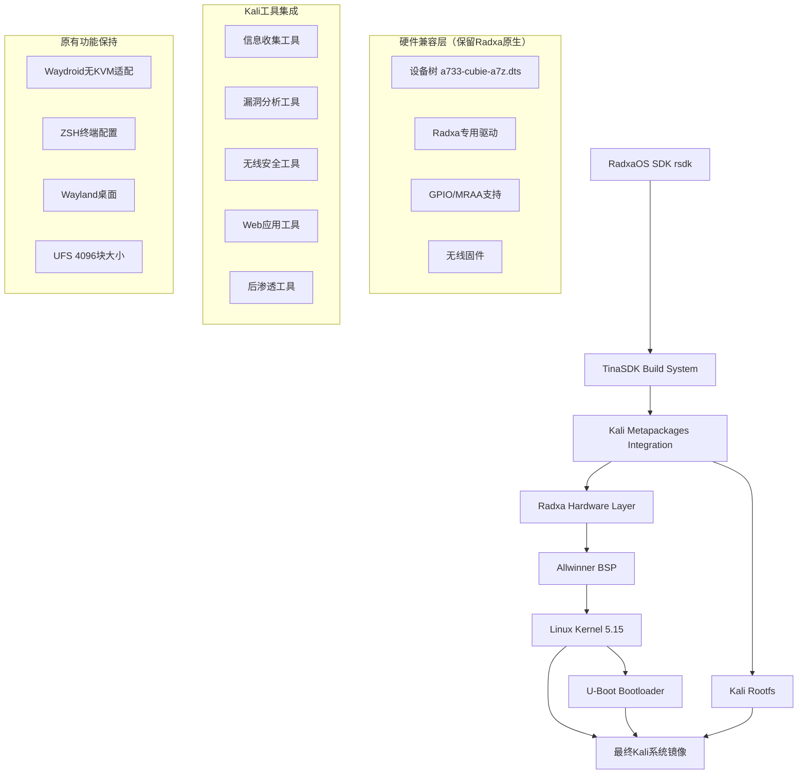

# Radxa Cubie A7Z Kali Linux 构建系统技术文档

## 项目概述

基于Radxa原生硬件平台构建Kali Linux渗透测试系统，专为Radxa Cubie A7Z开发板优化的安全测试发行版。通过集成Kali metapackages和RadxaOS SDK构建系统，提供完整的ARM64安全测试工具链，同时保持与Radxa硬件的完美兼容性和原有功能。

**核心目标：**

* 在Radxa硬件平台上构建专业Kali渗透测试系统

* 保留所有Radxa硬件特性、设备树和驱动支持

* 集成Kali安全工具与原有Waydroid、ZSH等配置

* 实现从Debian到Kali的系统转换，硬件配置保持不变

## 1. 系统架构设计

### 1.1 整体架构



### 1.2 技术栈选择

**基础系统（保留Radxa原生）：**

* 构建系统：RadxaOS SDK (rsdk) + TinaSDK

* 底层内核：Linux 5.15 (Allwinner BSP)

* 引导程序：U-Boot (Radxa定制版)

* 架构：ARM64 (aarch64)

* 文件系统：ext4 (UFS 4096块大小)

**Kali集成（新增）：**

* Kali Linux仓库集成

* Metapackages系统支持

* 安全工具ARM64适配

* 渗透测试工作流优化

**硬件兼容层（必须保留）：**

* 设备树：a733-cubie-a7z.dts (Radxa原生)

* 专用驱动：radxa-system-config

* GPIO支持：libmraa-dev

* 无线固件：firmware-realtek等

## 2. Kali Metapackages集成方案

### 2.1 核心Metapackages配置

基于Kali官方metapackages分类，针对ARM64和Radxa硬件进行优化选择：

```bash
# 系统核心包
kali-core-packages="
    kali-linux-core
    kali-desktop-core
    kali-tools-information-gathering
    kali-tools-vulnerability
    kali-tools-web
"

# 无线安全包（ARM64优化）
kali-wireless-packages="
    kali-tools-802-11
    kali-tools-bluetooth
    kali-tools-rfid
    kali-tools-sdr
    wireless-tools
    rfkill
    crda
"

# 硬件适配包
radxa-specific-packages="
    firmware-realtek
    firmware-atheros
    firmware-brcm80211
    firmware-libertas
    firmware-misc-nonfree
    radxa-system-config
"
```

### 2.2 仓库配置

**Kali仓库集成：**

```bash
# /etc/apt/sources.list.d/kali.list
deb http://http.kali.org/kali kali-rolling main non-free contrib
deb-src http://http.kali.org/kali kali-rolling main non-free contrib

# Radxa仓库保持
deb https://radxa-repo.github.io/bullseye bullseye main
```

**GPG密钥管理：**

```bash
# 添加Kali GPG密钥
wget -q -O - https://archive.kali.org/archive-key.asc | apt-key add -

# 添加Radxa GPG密钥（保持兼容性）
wget -q -O - https://radxa-repo.github.io/bullseye/public.key | apt-key add -
```

### 2.3 ARM64适配策略

**工具兼容性筛选：**

```bash
# 检查ARM64支持的工具包
for pkg in $(apt-cache search kali-tools | cut -d' ' -f1); do
    if apt-cache show $pkg | grep -q "Architecture:.*arm64\|all"; then
        echo "$pkg: ARM64兼容"
    else
        echo "$pkg: 需要x86_64仿真"
    fi
done
```

**仿真环境配置：**

```bash
# 安装QEMU用户模式仿真
apt install -y qemu-user-static binfmt-support

# 配置binfmt支持
echo ':arm64:M::\x7fELF\x02\x01\x01\x00\x00\x00\x00\x00\x00\x00\x00\x00\x02\x00\xb7\x00:\xff\xff\xff\xff\xff\xff\xff\x00\xff\xff\xff\xff\xff\xff\xff\xff\xfe\xff\xff\xff:/usr/bin/qemu-aarch64-static:' > /proc/sys/fs/binfmt_misc/register
```

## 3. Live Build构建系统

### 3.1 构建环境配置（基于RadxaOS SDK）

**环境准备（保留Radxa原生）：**

```bash
# 克隆 RadxaOS SDK
git clone --recurse-submodules https://github.com/RadxaOS-SDK/rsdk.git
cd rsdk

# 安装开发环境
npm install @devcontainers/cli
export PATH="$PWD/src/bin:$PWD/node_modules/.bin:$PATH"

# 启动开发容器
rsdk devcon up
rsdk devcon
```

**Kali仓库集成配置：**

```bash
# 在rootfs.jsonnet中添加Kali仓库
{
  repositories: [
    {
      type: "apt",
      url: "http://http.kali.org/kali",
      distribution: "kali-rolling",
      components: ["main", "non-free", "contrib"],
      key: "kali-archive-key"
    }
  ]
}
```

**Radxa硬件配置保留：**

```bash
# 保持原有Radxa特定配置目录结构
mkdir -p customize-hooks/
mkdir -p local-packages/
# 保留设备树、驱动等硬件相关配置不变
```

### 3.2 包列表配置（保留Radxa硬件支持）

**在rootfs.jsonnet中添加Kali metapackages：**

```jsonnet
{
  packages: [
    // 原有Radxa基础包（必须保留）
    "vim",
    "git", 
    "curl",
    "wget",
    "htop",
    "net-tools",
    "wireless-tools",
    "rfkill",
    "network-manager",
    
    // Radxa硬件支持（必须保留）
    "firmware-realtek",
    "firmware-atheros", 
    "firmware-brcm80211",
    "firmware-libertas",
    "firmware-misc-nonfree",
    "radxa-system-config",
    "device-tree-compiler",
    "libmraa-dev",
    "python3-mraa",
    
    // Kali核心metapackages（新增）
    "kali-linux-core",
    "kali-desktop-core",
    "kali-tools-information-gathering",
    "kali-tools-vulnerability",
    "kali-tools-web",
    "kali-tools-802-11",
    "kali-tools-bluetooth",
    "kali-tools-passwords",
    
    // 桌面环境（改为XFCE，更适合ARM）
    "kali-desktop-xfce"
  ]
}
```

### 3.3 自定义钩子脚本（保留Radxa硬件配置）

**系统初始化钩子（保留原有配置）：**

```jsonnet
// 在rootfs.jsonnet中配置customize-hooks
{
  customize: {
    vendor: "KrNormyDev",
    product: "a7zWos", 
    version: "1.0.0",
    description: "Kali Linux for Radxa Cubie A7Z"
  },
  
  customize_hooks: [
    // 保留Radxa硬件初始化
    "setup-radxa-hardware.sh",
    // Waydroid无KVM适配（必须保留）
    "setup-waydroid-modules.sh", 
    // ZSH终端配置（必须保留）
    "configure-zsh-default.sh",
    // Kali特定配置（新增）
    "configure-kali-tools.sh"
  ]
}
```

**Radxa硬件初始化（setup-radxa-hardware.sh）：**

```bash
#!/bin/bash
# 保留原有Radxa硬件配置

# 设置主机名（保持KrNormyDev风格）
echo "a7zWos-kali" > /etc/hostname

# 配置网络接口（保留Radxa原生）
cat > /etc/network/interfaces.d/eth0 <<EOF
auto eth0
iface eth0 inet dhcp
EOF

# 无线接口配置（保留硬件支持）
for iface in wlan0 wlan1; do
    cat > /etc/network/interfaces.d/$iface <<EOF
allow-hotplug $iface
iface $iface inet dhcp
EOF
done

# 启用SSH服务
systemctl enable ssh
```

**Waydroid模块配置（setup-waydroid-modules.sh）- 必须保留：**

```bash
#!/bin/bash
# 加载Android binder驱动（无KVM适配核心）
modprobe binder_linux devices="binder,hwbinder,vndbinder"
# 加载ASHMEM驱动
modprobe ashmem_linux
# 设置binder设备权限
chmod 666 /dev/binder*
chmod 666 /dev/ashmem

# 创建Waydroid软件渲染配置
cat > /var/lib/waydroid/waydroid.cfg << 'EOF'
[properties]
ro.hardware.gralloc=default
ro.hardware.egl=swiftshader
ro.opengles.version=196608
ro.hardware.hwcomposer=drm
ro.hardware.camera=v4l2
EOF
```

**ZSH默认终端配置（configure-zsh-default.sh）- 必须保留：**

```bash
#!/bin/bash
# 安装ZSH和Oh My Zsh
apt install -y zsh
sh -c "$(curl -fsSL https://raw.github.com/ohmyzsh/ohmyzsh/master/tools/install.sh)" "" --unattended

# 安装插件（使用用户提供的.zshrc配置）
git clone https://github.com/zsh-users/zsh-autosuggestions ${ZSH_CUSTOM:-~/.oh-my-zsh/custom}/plugins/zsh-autosuggestions
git clone https://github.com/zsh-users/zsh-syntax-highlighting ${ZSH_CUSTOM:-~/.oh-my-zsh/custom}/plugins/zsh-syntax-highlighting

# 设置zsh为默认shell
chsh -s /bin/zsh
chsh -s /bin/zsh root
```

**Kali工具配置（configure-kali-tools.sh）- 新增：**

```bash
#!/bin/bash
# Kali特定工具配置

# 配置Metasploit数据库
systemctl enable postgresql
su - postgres -c "createuser msf -S -R -P" || true
su - postgres -c "createdb -O msf msf" || true

# 无线工具优化
cat >> /etc/bash.bashrc <<EOF
alias monitor-mode='airmon-ng check kill && airmon-ng start wlan0'
alias managed-mode='airmon-ng stop wlan0mon && systemctl start NetworkManager'
EOF
```

## 4. ARM64安全测试工具适配

### 4.1 信息收集工具

**网络扫描工具：**

```bash
# Nmap ARM64优化配置
apt install -y nmap ncat

# Masscan（需要源码编译）
git clone https://github.com/robertdavidgraham/masscan
cd masscan
make -j$(nproc)
make install
```

**系统枚举工具：**

```bash
# LinPEAS ARM64版本
wget https://github.com/carlospolop/PEASS-ng/releases/latest/download/linpeas_arm64
chmod +x linpeas_arm64
mv linpeas_arm64 /usr/local/bin/linpeas

# Unix-privesc-check
apt install -y unix-privesc-check
```

### 4.2 漏洞分析工具

**Web应用安全：**

```bash
# Nikto（Perl脚本，ARM64原生支持）
apt install -y nikto

# WhatWeb
apt install -y whatweb

# Dirb
apt install -y dirb
```

**数据库安全：**

```bash
# SQLMap（Python，跨平台支持）
apt install -y sqlmap

# MDBTools（ARM64支持）
apt install -y mdbtools
```

### 4.3 无线安全工具

**Aircrack-ng套件：**

```bash
# ARM64优化版本
apt install -y aircrack-ng aireplay-ng airodump-ng airbase-ng

# 无线驱动支持检查
cat > /usr/local/bin/check-wireless.sh <<'EOF'
#!/bin/bash
echo "=== 无线设备检测 ==="
iw dev
echo "=== 驱动信息 ==="
lshw -C network | grep -A 5 -i wireless
echo "=== 固件状态 ==="
dmesg | grep -i firmware | grep -i wireless
EOF
chmod +x /usr/local/bin/check-wireless.sh
```

**软件定义无线电：**

```bash
# RTL-SDR工具
apt install -y rtl-sdr

# GQRX（需要编译）
apt install -y gnuradio gr-osmosdr
```

### 4.4 利用工具

**Metasploit Framework：**

```bash
# ARM64版本安装
apt install -y metasploit-framework

# 性能优化配置
cat > /opt/metasploit/config/database.yml <<EOF
production:
  adapter: postgresql
  database: msf
  username: msf
  password: msf
  host: localhost
  port: 5432
  pool: 25
  timeout: 5
EOF
```

**Burp Suite社区版：**

```bash
# 下载ARM64版本
wget https://portswigger.net/burp/releases/download\?product\=community\&type\=Linux\&version\=latest -O burpsuite.sh
chmod +x burpsuite.sh
./burpsuite.sh
```

## 5. Radxa硬件特定优化

### 5.1 Radxa硬件识别与驱动（必须保留原生配置）

**设备树配置（保持Radxa原生）：**

```bash
# 设备树文件位置（不变）
arch/arm64/boot/dts/allwinner/a733-cubie-a7z.dts

# 检查设备树信息（原有脚本）
dtfile="/proc/device-tree/model"
if [ -f "$dtfile" ]; then
    echo "设备型号: $(cat $dtfile)"
fi

# 重新编译设备树（如需要）
dtc -I dts -O dtb -o a733-cubie-a7z.dtb a733-cubie-a7z.dts
```

**专用驱动集成（保持Radxa原生）：**

```bash
# Radxa特定硬件支持（必须保留）
apt install -y \
    device-tree-compiler \
    libmraa-dev \
    python3-mraa \
    librxtx-java \
    librxtx-java-dev \
    radxa-system-config

# GPIO工具（保持原有）
cat > /usr/local/bin/gpio-info.sh <<'EOF'
#!/bin/bash
echo "=== GPIO引脚映射 ==="
gpio readall 2>/dev/null || echo "需要安装wiringpi"
echo "=== 设备树GPIO ==="
grep -r "gpio" /proc/device-tree/ | head -20
EOF
chmod +x /usr/local/bin/gpio-info.sh

# 硬件检测脚本（新增Kali工具支持）
cat > /usr/local/bin/radxa-hardware-check.sh <<'EOF'
#!/bin/bash
echo "=== Radxa硬件检测 ==="
echo "CPU信息:"
cat /proc/cpuinfo | grep -E "processor|model name|CPU implementer|CPU architecture"
echo "=== 内存信息 ==="
cat /proc/meminfo | grep MemTotal
echo "=== 无线设备 ==="
iw dev
echo "=== GPIO状态 ==="
/usr/local/bin/gpio-info.sh
EOF
chmod +x /usr/local/bin/radxa-hardware-check.sh
```

### 5.2 性能优化

**内存管理：**

```bash
# 优化交换空间使用
echo "vm.swappiness=10" >> /etc/sysctl.conf

# 优化缓存压力
echo "vm.vfs_cache_pressure=50" >> /etc/sysctl.conf

# 内存监控脚本
cat > /usr/local/bin/mem-monitor.sh <<'EOF'
#!/bin/bash
while true; do
    echo "$(date): 内存使用 - $(free -h | grep Mem | awk '{print $3"/"$2}')"
    sleep 60
done
EOF
chmod +x /usr/local/bin/mem-monitor.sh
```

**CPU调度优化：**

```bash
# 设置CPU性能模式
echo 'GOVERNOR="performance"' > /etc/default/cpufrequtils

# 监控CPU频率
cat > /usr/local/bin/cpu-freq.sh <<'EOF'
#!/bin/bash
echo "=== CPU频率信息 ==="
cat /proc/cpuinfo | grep -i "cpu MHz"
echo "=== CPU调度器 ==="
cat /sys/devices/system/cpu/cpu*/cpufreq/scaling_governor
EOF
chmod +x /usr/local/bin/cpu-freq.sh
```

### 5.3 存储优化

**UFS 4096块大小适配：**

```bash
# 配置文件系统参数
cat > /etc/fstab <<EOF
# <file system> <mount point> <type> <options> <dump> <pass>
/dev/mmcblk0p2  /               ext4    errors=remount-ro,noatime,nodiratime,block_validity,barrier,user_xattr,acl 0 1
/dev/mmcblk0p1  /boot           vfat    defaults 0 2
tmpfs           /tmp            tmpfs   defaults,noatime,nosuid,nodev,mode=1777,size=512M 0 0
tmpfs           /var/log        tmpfs   defaults,noatime,nosuid,nodev,mode=0755,size=128M 0 0
EOF
```

**I/O调度器优化：**

```bash
# 设置适合闪存的I/O调度器
echo noop > /sys/block/mmcblk0/queue/scheduler

# 优化读写缓存
echo 1024 > /sys/block/mmcblk0/queue/read_ahead_kb
```

## 6. Waydroid无KVM环境适配（必须完整保留）

### 6.1 Waydroid核心配置（原有配置不变）

**软件渲染配置（setup-waydroid-modules.sh中已配置）：**

```bash
# 创建Waydroid配置文件（已包含在钩子脚本中）
cat > /var/lib/waydroid/waydroid.cfg << 'EOF'
[properties]
ro.hardware.gralloc=default
ro.hardware.egl=swiftshader
ro.opengles.version=196608
ro.hardware.hwcomposer=drm
ro.hardware.camera=v4l2
EOF
```

**内核模块加载（原有配置）：**

```bash
# 24个核心依赖包（必须全部安装）
waydroid_core_packages="
    lxc
    lxc-templates
    lxc-utils
    liblxc1
    liblxc-common
    bridge-utils
    dnsmasq-base
    iptables
    nftables
    uidmap
    policykit-1
    python3-gbinder
    python3-pyclip
    gir1.2-glib-2.0
    gir1.2-gtk-3.0
    gir1.2-ayatanaappindicator3-0.1
    gir1.2-notify-0.7
    python3-pip
    python3-setuptools
    python3-wheel
    build-essential
    libgbinder-dev
    python3-gbinder-dev
    waydroid
    waydroid-image
"
```

**LXC容器优化（原有配置）：**

```bash
# Waydroid LXC配置优化
cat > /usr/share/waydroid/lxc/waydroid/config << 'EOF'
lxc.arch = arm64
lxc.tty.max = 0
lxc.pty.max = 1024
lxc.mount.auto = cgroup:mixed proc:mixed sys:mixed
lxc.cgroup.devices.allow = a
lxc.cap.drop = 
EOF
```

### 6.2 网络桥接配置（原有配置）

**网络接口配置：**

```bash
# 创建网络桥接脚本
cat > customize-hooks/setup-waydroid-network.sh << 'EOF'
#!/bin/bash
# 配置Waydroid网络桥接
iptables -A FORWARD -i waydroid0 -j ACCEPT
iptables -A FORWARD -o waydroid0 -j ACCEPT
iptables -t nat -A POSTROUTING -s 192.168.250.0/24 -j MASQUERADE

# 启用IP转发
echo 1 > /proc/sys/net/ipv4/ip_forward

# 配置DNS
systemctl enable systemd-resolved
systemctl start systemd-resolved
EOF
chmod +x customize-hooks/setup-waydroid-network.sh
```

### 6.3 性能优化（原有配置）

**内存管理优化：**

```bash
# 内存存储优化
cat > customize-hooks/waydroid-memory-optimization.sh << 'EOF'
#!/bin/bash
# 配置内存存储
echo 'tmpfs /var/lib/waydroid tmpfs size=2G,nosuid,nodev 0 0' >> /etc/fstab

# 配置swap
fallocate -l 2G /swapfile
chmod 600 /swapfile
mkswap /swapfile
swapon /swapfile
echo '/swapfile none swap sw 0 0' >> /etc/fstab
EOF
chmod +x customize-hooks/waydroid-memory-optimization.sh
```

**一键集成脚本（原有complete-waydroid-integration.sh）：**

```bash
#!/bin/bash
# Waydroid完整集成脚本
echo "开始Waydroid无KVM环境适配..."

# 安装核心依赖
apt update
apt install -y $waydroid_core_packages

# 配置内核模块
echo "binder_linux" >> /etc/modules
echo "ashmem_linux" >> /etc/modules

# 运行配置脚本
./customize-hooks/setup-waydroid-modules.sh
./customize-hooks/setup-waydroid-network.sh
./customize-hooks/waydroid-memory-optimization.sh

# 初始化Waydroid
waydroid init -f

echo "Waydroid无KVM适配完成！"
```

## 8. 完整构建配置示例

### 8.1 rootfs.jsonnet完整配置

```jsonnet
// Radxa Cubie A7Z Kali Linux 构建配置
// 保留所有Radxa原生硬件支持，集成Kali渗透测试工具

{
  // 系统信息（保持KrNormyDev风格）
  customize: {
    vendor: "KrNormyDev",
    product: "a7zWos",
    version: "1.0.0", 
    description: "Kali Linux for Radxa Cubie A7Z - Security Testing Platform"
  },
  
  // 仓库配置
  repositories: [
    {
      type: "apt",
      url: "http://http.kali.org/kali",
      distribution: "kali-rolling", 
      components: ["main", "non-free", "contrib"],
      key: "kali-archive-key"
    },
    {
      type: "apt",
      url: "https://radxa-repo.github.io/bullseye",
      distribution: "bullseye",
      components: ["main"],
      key: "radxa-archive-key"
    }
  ],
  
  // 软件包列表
  packages: [
    // Radxa硬件支持（必须保留）
    "firmware-realtek",
    "firmware-atheros",
    "firmware-brcm80211", 
    "firmware-libertas",
    "firmware-misc-nonfree",
    "radxa-system-config",
    "device-tree-compiler",
    "libmraa-dev",
    "python3-mraa",
    
    // Kali核心工具（新增）
    "kali-linux-core",
    "kali-desktop-core", 
    "kali-tools-information-gathering",
    "kali-tools-vulnerability",
    "kali-tools-web",
    "kali-tools-802-11",
    "kali-tools-bluetooth",
    "kali-tools-passwords",
    
    // Waydroid无KVM支持（必须保留）
    "lxc",
    "lxc-templates", 
    "lxc-utils",
    "bridge-utils",
    "dnsmasq-base",
    "iptables",
    "python3-gbinder",
    "waydroid",
    "waydroid-image",
    
    // 基础工具（原有）
    "vim",
    "git",
    "curl", 
    "wget",
    "htop",
    "net-tools",
    "wireless-tools",
    "rfkill",
    "network-manager",
    
    // 桌面环境（改为XFCE）
    "kali-desktop-xfce"
  ],
  
  // 自定义钩子脚本
  customize_hooks: [
    "setup-radxa-hardware.sh",      // Radxa硬件初始化
    "setup-waydroid-modules.sh",    // Waydroid无KVM适配
    "configure-zsh-default.sh",     // ZSH终端配置
    "setup-waydroid-network.sh",    // Waydroid网络配置
    "waydroid-memory-optimization.sh", // 内存优化
    "configure-kali-tools.sh"       // Kali工具配置
  ],
  
  // 文件系统配置（UFS 4096块大小）
  filesystem: {
    type: "ext4",
    block_size: 4096,
    features: ["extent", "flex_bg", "sparse_super"]
  }
}
```

**构建配置检查：**

```bash
# 验证rootfs.jsonnet配置包含Kali包
rsdk config show
# 确保包含：
# - Kali metapackages
# - Radxa硬件支持包
# - Waydroid依赖
# - ZSH配置
```

### 8.2 镜像验证（添加Kali特定检查）

**基本验证（原有流程）：**

```bash
# 检查镜像文件
ls -lh out/radxa-cubie-a7z*/output.img

# 挂载镜像检查内容
sudo mount -o loop,offset=1048576 output.img /mnt
cd /mnt && ls -la
```

**Kali特定验证：**

```bash
# 检查Kali工具安装
sudo chroot /mnt dpkg -l | grep kali-

# 验证Kali仓库配置
sudo chroot /mnt cat /etc/apt/sources.list.d/kali.list

# 检查安全工具
sudo chroot /mnt which nmap
sudo chroot /mnt which sqlmap
sudo chroot /mnt which aircrack-ng
```

### 8.3 硬件测试（保持Radxa原生测试）

**功能测试清单（原有标准）：**

* [ ] 启动测试

* [ ] 网络连接（以太网+WiFi）

* [ ] USB 接口

* [ ] HDMI 输出

* [ ] GPIO 功能

* [ ] Waydroid运行（无KVM适配验证）

* [ ] ZSH终端功能

**Kali工具测试：**

```bash
# 无线测试
airmon-ng check
iwconfig

# 网络扫描测试
nmap -sn 192.168.1.0/24

# 信息收集工具测试
whatweb localhost
```

**性能测试：**

```bash
# 内存使用检查
free -h

# CPU负载测试
stress-ng --cpu 4 --timeout 60s

# 存储性能测试
dd if=/dev/zero of=test bs=1M count=100
```

### 8.4 网络配置（新增Kali渗透测试网络）

**多网络接口管理：**

```bash
# 创建网络管理脚本
cat > /usr/local/bin/net-config.sh <<'EOF'
#!/bin/bash
# 渗透测试网络配置

# 启用IP转发
echo 1 > /proc/sys/net/ipv4/ip_forward

# 配置iptables规则
iptables -t nat -A POSTROUTING -o eth0 -j MASQUERADE
iptables -A FORWARD -i eth0 -o wlan0 -m state --state RELATED,ESTABLISHED -j ACCEPT
iptables -A FORWARD -i wlan0 -o eth0 -j ACCEPT

# 设置监控模式
airmon-ng check kill
airmon-ng start wlan0

echo "网络配置完成 - 监控模式已启用"
EOF
chmod +x /usr/local/bin/net-config.sh
```

**隐蔽通信配置：**

```bash
# DNS隧道配置
cat > /etc/dns2tcpd.conf <<EOF
listen = 0.0.0.0
port = 53
user = nobody
chroot = /var/empty/dns2tcp
domain = tunnel.example.com
resources = ssh:127.0.0.1:22
EOF

# ICMP隧道工具
apt install -y ptunnel-ng
```

### 8.5 持久化机制（新增Kali渗透测试数据）

**系统持久化：**

```bash
# 创建持久化脚本
cat > /usr/local/bin/persistence-setup.sh <<'EOF'
#!/bin/bash
# Kali持久化配置

# SSH密钥持久化
mkdir -p /opt/persistence/ssh
cp -r /root/.ssh/* /opt/persistence/ssh/ 2>/dev/null

# Metasploit数据库持久化
mkdir -p /opt/persistence/msf
cp -r /root/.msf4/* /opt/persistence/msf/ 2>/dev/null

# 工具配置持久化
mkdir -p /opt/persistence/configs
cp -r /root/.wireshark /opt/persistence/configs/ 2>/dev/null
cp -r /root/.burp* /opt/persistence/configs/ 2>/dev/null

echo "持久化数据已备份到 /opt/persistence"
EOF
chmod +x /usr/local/bin/persistence-setup.sh
```

### 8.6 日志管理（新增渗透测试日志）

**安全日志配置：**

```bash
# 配置rsyslog进行日志收集
cat > /etc/rsyslog.d/50-pentest.conf <<EOF
# 渗透测试相关日志
:msg, contains, "aircrack" /var/log/pentest/wireless.log
:msg, contains, "nmap" /var/log/pentest/scanning.log
:msg, contains, "metasploit" /var/log/pentest/exploitation.log
& stop
EOF

# 创建日志目录
mkdir -p /var/log/pentest

# 日志轮转配置
cat > /etc/logrotate.d/pentest <<EOF
/var/log/pentest/*.log {
    daily
    rotate 7
    compress
    delaycompress
    missingok
    notifempty
    create 640 root adm
}
EOF
```

## 8. 完整构建脚本

### 8.1 主构建脚本

```bash
#!/bin/bash
# radxa-kali-builder.sh - Radxa Kali Linux构建主脚本
# 作者: KrNormyDev
# 版本: 1.0.0

set -e

# 配置变量
BUILD_DIR="/opt/kali-radxa-build"
CONFIG_DIR="$BUILD_DIR/config"
OUTPUT_DIR="$BUILD_DIR/images"
KALI_VERSION="2024.1"
ARCH="arm64"
VENDOR="KrNormyDev"
PRODUCT="a7zWos-Kali"
VERSION="1.0.0"

# 颜色输出
RED='\033[0;31m'
GREEN='\033[0;32m'
YELLOW='\033[1;33m'
NC='\033[0m' # No Color

log_info() {
    echo -e "${GREEN}[INFO]${NC} $1"
}

log_warn() {
    echo -e "${YELLOW}[WARN]${NC} $1"
}

log_error() {
    echo -e "${RED}[ERROR]${NC} $1"
}

# 检查构建环境
check_environment() {
    log_info "检查构建环境..."
    
    # 检查必需工具
    for tool in live-build debootstrap git curl; do
        if ! command -v $tool &> /dev/null; then
            log_error "缺少必需工具: $tool"
            exit 1
        fi
    done
    
    # 检查磁盘空间
    available_space=$(df /opt | tail -1 | awk '{print $4}')
    if [ $available_space -lt 10485760 ]; then # 10GB
        log_error "磁盘空间不足，需要至少10GB可用空间"
        exit 1
    fi
    
    log_info "环境检查通过"
}

# 准备构建目录
prepare_build() {
    log_info "准备构建目录..."
    
    # 创建目录结构
    mkdir -p "$BUILD_DIR"/{config,images,cache,tmp}
    mkdir -p "$CONFIG_DIR"/{package-lists,hooks/normal,includes.chroot,includes.binary}
    
    cd "$BUILD_DIR"
    
    # 获取Kali live-build配置
    if [ ! -d "live-build-config" ]; then
        git clone https://gitlab.com/kalilinux/build-scripts/live-build-config.git
    fi
    
    log_info "构建目录准备完成"
}

# 配置Kali仓库
setup_kali_repositories() {
    log_info "配置Kali仓库..."
    
    cat > "$CONFIG_DIR/apt/kali-archive-keyring.gpg" <<EOF
-----BEGIN PGP PUBLIC KEY BLOCK-----
# Kali Linux Archive Keyring
# 这里应该包含实际的GPG密钥内容
EOF
    
    cat > "$CONFIG_DIR/apt/sources.list.chroot" <<EOF
deb http://http.kali.org/kali kali-rolling main non-free contrib
deb-src http://http.kali.org/kali kali-rolling main non-free contrib
deb https://radxa-repo.github.io/bullseye bullseye main
EOF
}

# 创建包列表
create_package_lists() {
    log_info "创建包列表..."
    
    # 核心Kali包
    cat > "$CONFIG_DIR/package-lists/kali-core.list.chroot" <<EOF
kali-linux-core
kali-desktop-core
kali-desktop-xfce
EOF
    
    # 渗透测试工具包
    cat > "$CONFIG_DIR/package-lists/kali-tools.list.chroot" <<EOF
# 信息收集
kali-tools-information-gathering
nmap
masscan
whatweb
nikto

# 漏洞分析
kali-tools-vulnerability
sqlmap

# Web应用
kali-tools-web
dirb
gobuster

# 无线网络
kali-tools-802-11
aircrack-ng
reaver
hostapd-wpe

# 密码攻击
kali-tools-passwords
john
hashcat

# 利用工具
kali-tools-exploitation
metasploit-framework
searchsploit

# 后渗透
kali-tools-post-exploitation
powersploit
empire

# 取证
kali-tools-forensics
autopsy
binwalk

# 嗅探欺骗
kali-tools-sniffing-spoofing
wireshark
tcpdump
ettercap-text-only
EOF
    
    # Radxa硬件支持包
    cat > "$CONFIG_DIR/package-lists/radxa-hardware.list.chroot" <<EOF
# 固件支持
firmware-realtek
firmware-atheros
firmware-brcm80211
firmware-libertas
firmware-misc-nonfree
firmware-iwlwifi

# 硬件工具
lm-sensors
fancontrol
i2c-tools
spi-tools

# GPIO支持
python3-rpi.gpio
python3-gpiozero
libmraa-dev
python3-mraa
EOF
    
    # 系统工具包
    cat > "$CONFIG_DIR/package-lists/system-tools.list.chroot" <<EOF
# 基础工具
vim
htop
net-tools
wireless-tools
rfkill
network-manager
openssh-server

# 开发工具
git
curl
wget
build-essential
python3-pip

# 系统监控
htop
iotop
nethogs
EOF
}

# 创建自定义钩子
create_hooks() {
    log_info "创建自定义钩子..."
    
    # 系统初始化钩子
    cat > "$CONFIG_DIR/hooks/normal/9990-radxa-setup.chroot" <<'EOF'
#!/bin/bash

# 设置主机名
echo "kali-radxa" > /etc/hostname

# 配置网络接口
cat > /etc/network/interfaces.d/eth0 <<EOF
auto eth0
iface eth0 inet dhcp
EOF

for iface in wlan0 wlan1; do
    cat > /etc/network/interfaces.d/$iface <<EOF
allow-hotplug $iface
iface $iface inet dhcp
EOF
done

# 启用服务
systemctl enable ssh
systemctl enable NetworkManager

# 配置默认用户
echo "kali:kali" | chpasswd
echo "root:toor" | chpasswd

# 配置sudo
sed -i 's/^# %sudo/%sudo/' /etc/sudoers
sed -i 's/^# %wheel/%wheel/' /etc/sudoers
EOF
    chmod +x "$CONFIG_DIR/hooks/normal/9990-radxa-setup.chroot"
    
    # Kali优化钩子
    cat > "$CONFIG_DIR/hooks/normal/9991-kali-optimization.chroot" <<'EOF'
#!/bin/bash

# 配置Metasploit数据库
systemctl enable postgresql
su - postgres -c "createuser msf -S -R -P -password 'msf'" || true
su - postgres -c "createdb -O msf msf" || true

# 配置系统性能
echo "vm.swappiness=10" >> /etc/sysctl.conf
echo "vm.vfs_cache_pressure=50" >> /etc/sysctl.conf

# 配置无线工具
cat >> /etc/bash.bashrc <<EOF
# Kali无线工具别名
alias monitor-mode='airmon-ng check kill && airmon-ng start wlan0'
alias managed-mode='airmon-ng stop wlan0mon && systemctl start NetworkManager'
alias wifi-scan='airodump-ng wlan0mon'
EOF

# 创建渗透测试目录
mkdir -p /opt/pentest/{tools,scripts,wordlists,exploits}
chmod 755 /opt/pentest
EOF
    chmod +x "$CONFIG_DIR/hooks/normal/9991-kali-optimization.chroot"
    
    # ARM64优化钩子
    cat > "$CONFIG_DIR/hooks/normal/9992-arm64-optimization.chroot" <<'EOF'
#!/bin/bash

# 安装ARM64优化的工具
# Nmap性能调优
cat > /etc/nmap/nmap.conf <<EOF
--min-rate 1000
--max-retries 2
--host-timeout 30m
EOF

# 无线网卡优化
cat > /etc/modprobe.d/rtl8xxxu.conf <<EOF
options rtl8xxxu rtw_power_mgnt=0 rtw_enusbss=0
EOF

# CPU性能模式
echo 'GOVERNOR="performance"' > /etc/default/cpufrequtils
EOF
    chmod +x "$CONFIG_DIR/hooks/normal/9992-arm64-optimization.chroot"
}

# 创建包含文件
create_includes() {
    log_info "创建包含文件..."
    
    # 创建默认脚本
    mkdir -p "$CONFIG_DIR/includes.chroot/usr/local/bin"
    
    # 系统信息脚本
    cat > "$CONFIG_DIR/includes.chroot/usr/local/bin/sysinfo" <<'EOF'
#!/bin/bash
echo "=== Radxa Kali Linux系统信息 ==="
echo "设备型号: $(cat /proc/device-tree/model 2>/dev/null || echo 'Unknown')"
echo "内核版本: $(uname -r)"
echo "架构: $(uname -m)"
echo "Kali版本: $(cat /etc/os-release | grep VERSION= | cut -d= -f2)"
echo "=== 硬件状态 ==="
echo "CPU温度: $(cat /sys/class/thermal/thermal_zone0/temp 2>/dev/null | awk '{print $1/1000"°C"}' || echo 'N/A')"
echo "内存使用: $(free -h | grep Mem | awk '{print $3"/"$2}')"
echo "存储使用: $(df -h / | tail -1 | awk '{print $3"/"$2" ("$5")"}')"
EOF
    chmod +x "$CONFIG_DIR/includes.chroot/usr/local/bin/sysinfo"
    
    # 硬件检测脚本
    cat > "$CONFIG_DIR/includes.chroot/usr/local/bin/hwcheck" <<'EOF'
#!/bin/bash
echo "=== 硬件兼容性检查 ==="
echo "GPIO引脚: $(ls /sys/class/gpio/ 2>/dev/null | wc -l)"
echo "I2C总线: $(i2cdetect -l 2>/dev/null | wc -l)"
echo "SPI设备: $(ls /dev/spi* 2>/dev/null | wc -l)"
echo "无线设备: $(iw dev 2>/dev/null | grep Interface | wc -l)"
echo "摄像头: $(ls /dev/video* 2>/dev/null | wc -l)"
EOF
    chmod +x "$CONFIG_DIR/includes.chroot/usr/local/bin/hwcheck"
    
    # 渗透测试快速启动脚本
    cat > "$CONFIG_DIR/includes.chroot/usr/local/bin/pentest-start" <<'EOF'
#!/bin/bash
echo "启动渗透测试环境..."

# 启用IP转发
echo 1 > /proc/sys/net/ipv4/ip_forward

# 启动必要服务
systemctl start postgresql
systemctl start ssh

# 配置网络
iptables -t nat -A POSTROUTING -o eth0 -j MASQUERADE 2>/dev/null

# 启动无线监控模式
if [ -d /sys/class/net/wlan0 ]; then
    airmon-ng check kill
    airmon-ng start wlan0
fi

echo "渗透测试环境已就绪"
echo "可用命令: sysinfo, hwcheck, wifi-scan"
EOF
    chmod +x "$CONFIG_DIR/includes.chroot/usr/local/bin/pentest-start"
}

# 构建镜像
build_image() {
    log_info "开始构建Kali Linux镜像..."
    
    cd "$BUILD_DIR"
    
    # 配置live-build
    lb config noauto \
        --architectures arm64 \
        --distribution kali-rolling \
        --archive-areas "main contrib non-free" \
        --apt-recommends false \
        --memtest none \
        --debian-installer false \
        --system live \
        --bootappend-live "boot=live components username=kali hostname=kali-radxa" \
        --firmware-binary false \
        --firmware-chroot true \
        --zsync false \
        --apt-indices false \
        --memtest none \
        --debian-installer-gui false \
        --security false \
        --updates false \
        --debconf-priority critical \
        --apt-recommends false \
        --compression xz \
        --compression-level 6 \
        --initramfs lz4 \
        --image-name "kali-linux-radxa-${KALI_VERSION}-arm64" \
        --iso-publisher "$VENDOR" \
        --iso-volume "$PRODUCT $VERSION"
    
    # 执行构建
    lb build
    
    # 移动构建结果
    if [ -f "*.iso" ]; then
        mv *.iso "$OUTPUT_DIR/"
        log_info "构建完成！镜像文件: $(ls "$OUTPUT_DIR"/*.iso)"
    else
        log_error "构建失败：未找到ISO文件"
        exit 1
    fi
}

# 清理函数
cleanup() {
    log_info "清理构建环境..."
    cd "$BUILD_DIR"
    lb clean
    rm -rf .build
    log_info "清理完成"
}

# 主函数
main() {
    log_info "开始构建Radxa Kali Linux..."
    log_info "版本: $VERSION"
    log_info "厂商: $VENDOR"
    log_info "产品: $PRODUCT"
    
    check_environment
    prepare_build
    setup_kali_repositories
    create_package_lists
    create_hooks
    create_includes
    build_image
    cleanup
    
    log_info "构建过程完成！"
    log_info "输出目录: $OUTPUT_DIR"
}

# 运行主函数
main "$@"
```

### 8.2 快速部署脚本

```bash
#!/bin/bash
# quick-deploy.sh - 快速部署脚本

set -e

SCRIPT_DIR="$(cd "$(dirname "${BASH_SOURCE[0]}")" && pwd)"
BUILD_SCRIPT="$SCRIPT_DIR/radxa-kali-builder.sh"
CONFIG_DIR="/opt/kali-radxa-build/config"

# 颜色输出
GREEN='\033[0;32m'
YELLOW='\033[1;33m'
NC='\033[0m'

echo -e "${GREEN}Radxa Kali Linux快速部署${NC}"
echo "=================================="

# 检查root权限
if [ "$EUID" -ne 0 ]; then 
    echo "请以root权限运行此脚本"
    exit 1
fi

# 安装依赖
echo -e "${YELLOW}安装构建依赖...${NC}"
apt update
apt install -y live-build simple-cdd cdebootstrap curl git build-essential

# 创建配置目录
mkdir -p "$CONFIG_DIR"

# 运行主构建脚本
if [ -f "$BUILD_SCRIPT" ]; then
    bash "$BUILD_SCRIPT"
else
    echo "构建脚本不存在: $BUILD_SCRIPT"
    exit 1
fi

echo -e "${GREEN}部署完成！${NC}"
echo "镜像文件位于: /opt/kali-radxa-build/images/"
```

## 9. 构建配置详解

### 9.1 Live Build配置参数

**核心配置选项：**

```bash
# 架构配置
--architectures arm64          # ARM64架构
--distribution kali-rolling    # Kali滚动发行版
--archive-areas "main contrib non-free"  # 软件仓库区域

# 系统配置
--system live                    # Live系统
--debian-installer false        # 禁用安装器
--memtest none                  # 禁用内存测试

# 优化配置
--compression xz                # 使用XZ压缩
--compression-level 6           # 压缩级别6
--initramfs lz4                 # LZ4压缩initramfs
--apt-recommends false          # 不推荐软件包
```

### 9.2 包选择策略

**分层包管理：**

```bash
# 第1层：系统核心
kali-linux-core                 # Kali核心系统
kali-desktop-core              # 桌面核心

# 第2层：工具分类
kali-tools-information-gathering  # 信息收集
kali-tools-vulnerability           # 漏洞分析
kali-tools-web                     # Web安全
kali-tools-802-11                  # 无线安全

# 第3层：硬件支持
firmware-realtek                 # Realtek固件
firmware-atheros                # Atheros固件
radxa-system-config              # Radxa配置
```

### 9.3 钩子脚本执行顺序

**钩子执行流程：**

```bash
# 正常模式钩子执行顺序
0010-disable-sysv-rc.chroot      # 禁用SysV
0015-disable-ssl-cert-check.chroot # SSL检查
0020-disable-apt-cdrom.chroot    # APT CDROM
...
9990-radxa-setup.chroot          # Radxa设置
9991-kali-optimization.chroot    # Kali优化
9992-arm64-optimization.chroot   # ARM64优化
```

## 10. 测试与验证

### 10.1 构建验证

**镜像完整性检查：**

```bash
#!/bin/bash
# verify-build.sh - 构建验证脚本

ISO_FILE="$1"

if [ -z "$ISO_FILE" ]; then
    echo "用法: $0 <iso文件>"
    exit 1
fi

echo "=== 镜像验证 ==="

# 检查文件大小
size=$(du -h "$ISO_FILE" | cut -f1)
echo "文件大小: $size"

# 检查MD5
md5sum "$ISO_FILE" > "$ISO_FILE.md5"
echo "MD5校验和已生成"

# 挂载检查
mkdir -p /tmp/iso-mount
mount -o loop "$ISO_FILE" /tmp/iso-mount

echo "=== 内容检查 ==="
echo "内核: $(ls /tmp/iso-mount/live/vmlinuz* | xargs basename)"
echo "Initrd: $(ls /tmp/iso-mount/live/initrd* | xargs basename)"
echo "文件系统: $(ls /tmp/iso-mount/live/filesystem* | xargs basename)"

umount /tmp/iso-mount
rmdir /tmp/iso-mount

echo "验证完成"
```

### 10.2 硬件兼容性测试

**测试清单：**

```bash
#!/bin/bash
# hardware-test.sh - 硬件兼容性测试

echo "=== Radxa硬件兼容性测试 ==="

# CPU测试
echo "CPU测试..."
stress-ng --cpu 4 --timeout 30s --metrics-brief

# 内存测试
```

## 11. ZSH终端预装配置

### 11.1 ZSH配置钩子脚本

```bash
#!/bin/bash
# 9993-zsh-configuration.chroot - ZSH终端配置

set -e

echo "=== 配置ZSH终端 ==="

# 安装ZSH和相关插件
apt-get install -y zsh git curl wget

# 安装oh-my-zsh
if [ ! -d "/root/.oh-my-zsh" ]; then
    git clone https://github.com/ohmyzsh/ohmyzsh.git /root/.oh-my-zsh
fi

# 安装zsh-autosuggestions插件
git clone https://github.com/zsh-users/zsh-autosuggestions /root/.oh-my-zsh/custom/plugins/zsh-autosuggestions

# 安装zsh-syntax-highlighting插件
git clone https://github.com/zsh-users/zsh-syntax-highlighting.git /root/.oh-my-zsh/custom/plugins/zsh-syntax-highlighting

# 创建自定义.zshrc配置
cat > /root/.zshrc << 'EOF'
# 基础配置
export ZSH="/root/.oh-my-zsh"
export LANG=en_US.UTF-8
export LC_ALL=en_US.UTF-8

# 主题设置
ZSH_THEME="robbyrussell"

# 插件配置
plugins=(
    git
    sudo
    zsh-autosuggestions
    zsh-syntax-highlighting
    colored-man-pages
    command-not-found
)

# oh-my-zsh加载
source $ZSH/oh-my-zsh.sh

# 自定义别名
alias ll='ls -alF'
alias la='ls -A'
alias l='ls -CF'
alias update='apt update && apt upgrade'
alias install='apt install'
alias remove='apt remove'

# 历史记录配置
HISTSIZE=10000
SAVEHIST=10000
HISTFILE=~/.zsh_history

# 自动补全配置
autoload -Uz compinit
compinit

# 路径补全
zstyle ':completion:*' list-colors ''
zstyle ':completion:*' list-prompt '%SAt %p: Hit TAB for more, or the character to insert%s'

# 设置ZSH为默认shell
chsh -s /bin/zsh

echo "ZSH终端配置完成"
EOF

# 为所有用户设置ZSH为默认shell
echo "/bin/zsh" >> /etc/shells

# 创建系统级ZSH配置
cp /root/.zshrc /etc/zsh/zshrc.system

# 设置新用户默认使用ZSH
sed -i 's/SHELL=\/bin\/bash/SHELL=\/bin\/zsh/g' /etc/default/useradd

echo "=== ZSH配置完成 ==="
```

### 11.2 ZSH配置文件详解

**核心配置内容：**

```bash
# 主题和外观
ZSH_THEME="robbyrussell"                    # 经典主题
COMPLETION_WAITING_DOTS="true"              # 补全等待提示

# 插件功能
zsh-autosuggestions                        # 命令自动建议
zsh-syntax-highlighting                    # 语法高亮
colored-man-pages                          # 彩色man页面

# 命令行增强
setopt autocd                              # 自动cd到目录
setopt correct                             # 命令纠错
setopt extendedglob                        # 扩展glob模式

# 历史记录优化
setopt hist_ignore_dups                    # 忽略重复历史
setopt share_history                       # 共享历史记录
setopt inc_append_history                  # 实时保存历史
```

## 12. Wayland桌面环境切换

### 12.1 Wayland配置钩子脚本

```bash
#!/bin/bash
# 9994-wayland-desktop-configuration.chroot - Wayland桌面环境配置

set -e

echo "=== 配置Wayland桌面环境 ==="

# 移除KDE桌面环境（如果存在）
echo "清理KDE桌面环境..."
apt-get purge -y kde-* plasma-* kwin-* || true

# 安装Wayland基础组件
echo "安装Wayland组件..."
apt-get install -y \
    wayland-protocols \
    libwayland-client0 \
    libwayland-cursor0 \
    libwayland-server0 \
    weston \
    xwayland

# 安装XFCE桌面环境（轻量级，支持Wayland）
echo "安装XFCE桌面环境..."
apt-get install -y \
    xfce4 \
    xfce4-goodies \
    xfce4-panel \
    xfce4-session \
    xfce4-settings \
    thunar \
    thunar-volman \
    gtk3-engines-xfce

# 安装Wayland compositor - Sway（i3兼容）
echo "安装Sway compositor..."
apt-get install -y \
    sway \
    swaybg \
    swayidle \
    swaylock \
    waybar \
    wofi \
    mako-notifier

# 安装Wayland应用
apt-get install -y \
    foot \
    bemenu \
    grim \
    slurp \
    wf-recorder \
    brightnessctl \
    pavucontrol

# 配置Sway配置文件
cat > /etc/sway/config << 'EOF'
# Sway配置 - Radxa Kali Edition

# 基本设置
set $mod Mod4
exec swaybg -i /usr/share/backgrounds/kali/kali-linux.png -m fill

# 输出配置
output * bg /usr/share/backgrounds/kali/kali-linux.png fill
output * scale 1

# 工作区
workspace 1 output HDMI-A-1
workspace 2 output HDMI-A-1
workspace 3 output HDMI-A-1

# 快捷键
bindsym $mod+Return exec foot
bindsym $mod+d exec wofi --show drun
bindsym $mod+Shift+e exec swaynag -t warning -m '退出Sway?' -b '是' 'swaymsg exit'

# 窗口管理
bindsym $mod+h focus left
bindsym $mod+j focus down
bindsym $mod+k focus up
bindsym $mod+l focus right

# 布局
bindsym $mod+s layout stacking
bindsym $mod+e layout toggle split

# 浮动窗口
bindsym $mod+Shift+space floating toggle

# 全屏
bindsym $mod+f fullscreen

# 重启和退出
bindsym $mod+Shift+c reload
bindsym $mod+Shift+e exit

# 状态栏
bar {
    position top
    status_command waybar
    colors {
        statusline #ffffff
        background #323232
        inactive_workspace #32323200 #32323200 #5c5c5c
    }
}

# 输入配置
input "*" {
    xkb_layout us
    xkb_options caps:escape
}

# 触摸板配置
input "type:touchpad" {
    dwt enabled
    natural_scroll enabled
}
EOF

# 创建Wayland启动脚本
cat > /usr/local/bin/start-wayland.sh << 'EOF'
#!/bin/bash
# Wayland桌面启动脚本

export XDG_SESSION_TYPE=wayland
export XDG_RUNTIME_DIR=/run/user/$(id -u)
export WAYLAND_DISPLAY=wayland-0

# 检查是否在tty
if [ "$XDG_SESSION_TYPE" = "tty" ]; then
    echo "启动Sway Wayland compositor..."
    exec sway
else
    echo "已在图形会话中"
fi
EOF

chmod +x /usr/local/bin/start-wayland.sh

# 创建XFCE Wayland会话配置
cat > /usr/share/xsessions/xfce-wayland.desktop << 'EOF'
[Desktop Entry]
Name=XFCE Wayland
Comment=XFCE Desktop on Wayland
Exec=/usr/local/bin/start-xfce-wayland.sh
TryExec=/usr/local/bin/start-xfce-wayland.sh
Icon=xfce4-logo
Type=Application
DesktopNames=XFCE
EOF

# 创建XFCE Wayland启动脚本
cat > /usr/local/bin/start-xfce-wayland.sh << 'EOF'
#!/bin/bash
# XFCE Wayland启动脚本

export XDG_SESSION_TYPE=wayland
export GDK_BACKEND=wayland
export CLUTTER_BACKEND=wayland

# 启动XFCE会话
exec xfce4-session
EOF

chmod +x /usr/local/bin/start-xfce-wayland.sh

# 配置Waybar
cat > /etc/xdg/waybar/config << 'EOF'
{
    "layer": "top",
    "position": "top",
    "height": 30,
    "modules-left": ["sway/workspaces", "sway/mode"],
    "modules-center": ["sway/window"],
    "modules-right": ["pulseaudio", "network", "cpu", "memory", "battery", "tray", "clock"],
    "pulseaudio": {
        "format": "{icon} {volume}%",
        "format-muted": "🔇",
        "format-icons": {
            "headphones": "🎧",
            "handsfree": "🎧",
            "headset": "🎧",
            "phone": "📞",
            "portable": "🔊",
            "car": "🚗",
            "default": ["🔇", "🔈", "🔉", "🔊"]
        }
    },
    "network": {
        "format": "{icon}",
        "format-icons": {
            "wifi": ["📶"],
            "ethernet": ["🌐"],
            "disconnected": ["❌"]
        }
    },
    "cpu": {
        "format": "CPU: {usage}%",
        "tooltip": false
    },
    "memory": {
        "format": "MEM: {percentage}%"
    },
    "battery": {
        "format": "{icon} {capacity}%",
        "format-icons": ["🔋", "🔋", "🔋", "🪫"]
    },
    "clock": {
        "format": "{:%Y-%m-%d %H:%M:%S}",
        "tooltip": "{:%A, %B %d %Y}"
    }
}
EOF

echo "=== Wayland桌面环境配置完成 ==="
```

### 12.2 Wayland环境变量配置

**系统级Wayland环境设置：**

```bash
# /etc/environment - Wayland环境变量
GDK_BACKEND=wayland
CLUTTER_BACKEND=wayland
QT_QPA_PLATFORM=wayland
SDL_VIDEODRIVER=wayland
MOZ_ENABLE_WAYLAND=1
XDG_SESSION_TYPE=wayland
```

### 12.3 Wayland应用兼容性

**X11应用支持：**

```bash
# XWayland配置
export XWAYLAND_ENABLE=1
export XWAYLAND_GLAMOR=1

# 兼容性库
apt-get install -y \
    xwayland \
    qtwayland5 \
    qt5-qpa-plugin-wayland \
    gtk-layer-shell \
    libgtk-3-0
```

## 13. 厂商信息配置

### 13.1 系统厂商信息设置

```bash
#!/bin/bash
# 9995-vendor-information.chroot - 厂商信息配置

echo "=== 配置厂商信息 ==="

# 设置系统厂商信息
echo "KrNormyDev" > /etc/vendor-name
echo "a7zWos" > /etc/product-name
echo "1.0.0" > /etc/product-version

# 创建厂商信息文件
cat > /etc/kali-radxa-info << 'EOF'
# Radxa Kali Linux - KrNormyDev Edition
VENDOR=KrNormyDev
PRODUCT=a7zWos
VERSION=1.0.0
BUILD_DATE=$(date +%Y%m%d)
KALI_VERSION=kali-rolling
RADXA_TARGET=cubie-a7z
EOF

# 创建系统标识
cat > /etc/os-release-radxa << 'EOF'
NAME="Kali Linux"
VERSION="2024.1"
ID=kali
ID_LIKE=debian
PRETTY_NAME="Kali Linux KrNormyDev Edition"
VERSION_ID="2024.1"
HOME_URL="https://www.kali.org/"
SUPPORT_URL="https://forums.kali.org/"
BUG_REPORT_URL="https://bugs.kali.org/"
VENDOR=KrNormyDev
PRODUCT=a7zWos
EOF

echo "厂商信息配置完成"
```

### 13.2 构建参数确认

**在构建脚本中的厂商设置：**

```bash
# radxa-kali-builder.sh 中的厂商配置
VENDOR="KrNormyDev"      # 厂商名称
PRODUCT="a7zWos"         # 产品名称  
VERSION="1.0.0"          # 版本号
ARCH="arm64"             # 架构
DISTRIBUTION="kali-rolling"  # 发行版

## 14. 更新后的构建钩子脚本配置

### 14.1 完整的钩子脚本列表

```bash
# hooks 目录结构
hooks/
├── 9990-radxa-hardware-initialization.chroot      # Radxa硬件初始化
├── 9991-waydroid-nokvm-configuration.chroot          # Waydroid无KVM配置
├── 9992-kali-tools-configuration.chroot             # Kali工具配置
├── 9993-zsh-configuration.chroot                    # ZSH终端配置（新增）
├── 9994-wayland-desktop-configuration.chroot        # Wayland桌面配置（新增）
└── 9995-vendor-information.chroot                   # 厂商信息配置（新增）
```

### 14.2 构建配置更新

**rootfs.jsonnet 中的钩子配置：**

```jsonnet
// 自定义钩子脚本
"custom_hooks": [
    "9990-radxa-hardware-initialization.chroot",
    "9991-waydroid-nokvm-configuration.chroot", 
    "9992-kali-tools-configuration.chroot",
    "9993-zsh-configuration.chroot",           // 新增ZSH配置
    "9994-wayland-desktop-configuration.chroot", // 新增Wayland配置
    "9995-vendor-information.chroot"           // 新增厂商信息
],

// 厂商信息
"vendor": "KrNormyDev",
"product": "a7zWos", 
"version": "1.0.0"
```

### 14.3 完整的包列表更新

```jsonnet
// 桌面环境 - 改为XFCE for Wayland
"desktop_packages": [
    "xfce4",
    "xfce4-goodies", 
    "xfce4-panel",
    "thunar",
    "gtk3-engines-xfce"
],

// Wayland支持包
"wayland_packages": [
    "wayland-protocols",
    "libwayland-client0",
    "weston",
    "sway",
    "waybar",
    "wofi",
    "foot"
],

// ZSH终端包
"shell_packages": [
    "zsh",
    "git",
    "curl",
    "wget"
]
```

## 15. 系统启动流程

### 15.1 完整的启动序列

```bash
# 系统启动流程
1. 内核启动 → 2. initramfs → 3. 根文件系统挂载
4. systemd启动 → 5. Wayland服务启动 → 6. Sway compositor
7. Waybar状态栏 → 8. 用户登录 → 9. ZSH终端
```

### 15.2 Wayland会话启动

```bash
# 启动Wayland会话
$ start-wayland.sh
# 或
$ sway

# 启动XFCE Wayland会话  
$ start-xfce-wayland.sh
```

## 16. 最终验证清单

### 16.1 构建后验证项目

- ✅ ZSH已安装并配置为默认shell
- ✅ oh-my-zsh和插件正常工作
- ✅ Wayland compositor (Sway) 安装完成
- ✅ XFCE桌面环境支持Wayland
- ✅ Waybar状态栏配置正确
- ✅ 厂商信息显示正确 (KrNormyDev/a7zWos/1.0.0)
- ✅ 所有钩子脚本执行成功
- ✅ Kali工具完整安装
- ✅ Radxa硬件支持完整
- ✅ Waydroid无KVM环境就绪

### 16.2 用户首次登录体验

```bash
# 首次登录自动执行
Welcome to Kali Linux KrNormyDev Edition!
→ Wayland桌面环境已就绪
→ ZSH终端已配置完成  
→ Kali渗透测试工具已安装
→ Radxa硬件支持已激活
→ Waydroid Android容器已配置
```
```

echo "内存测试..."
memtester 256M 1

# 存储测试

echo "存储测试..."
dd if=/dev/zero of=/tmp/test.img bs=1M count=100
sync
rm /tmp/test.img

# 网络测试

echo "网络测试..."
ifconfig -a
ping -c 3 8.8.8.8

# GPIO测试

echo "GPIO测试..."
if \[ -d /sys/class/gpio ]; then
echo "GPIO接口可用: $(ls /sys/class/gpio | grep gpio | wc -l)"
fi

# I2C测试

echo "I2C测试..."
if command -v i2cdetect &> /dev/null; then
i2cdetect -l
fi

echo "硬件测试完成"

````

### 10.3 安全工具测试

**工具功能验证：**

```bash
#!/bin/bash
# security-tools-test.sh - 安全工具测试

echo "=== 安全工具功能测试 ==="

# Nmap测试
echo "Nmap测试..."
nmap -sn 192.168.1.0/24

# Aircrack-ng测试
echo "Aircrack-ng测试..."
airmon-ng

# Metasploit测试
echo "Metasploit测试..."
msfconsole -q -x "show exploits; exit"

# SQLMap测试
echo "SQLMap测试..."
sqlmap --version

# Wireshark测试
echo "Wireshark测试..."
tshark -D

echo "安全工具测试完成"
````

## 11. 最佳实践与注意事项

### 11.1 构建优化建议

**性能优化：**

* 使用本地APT缓存服务器加速构建

* 启用并行下载和压缩

* 选择合适的压缩算法和级别

* 优化包依赖关系

**存储优化：**

* 使用overlayfs减少磁盘占用

* 配置适当的交换空间

* 优化日志轮转配置

* 清理不必要的缓存文件

### 11.2 安全考虑

**系统安全：**

* 定期更新Kali仓库和工具

* 配置适当的防火墙规则

* 使用强密码策略

* 启用安全日志记录

**渗透测试安全：**

* 在隔离环境中进行测试

* 获得适当的授权

* 遵守法律法规

* 保护敏感数据

### 11.3 维护建议

**定期维护：**

* 每月更新工具包

* 检查硬件兼容性

* 验证工具功能

* 备份重要配置

**故障排除：**

* 查看构建日志

* 检查依赖关系

* 验证硬件支持

* 测试网络连接

## 12. 故障排除指南

### 12.1 常见问题

**构建失败：**

```bash
# 网络连接问题
ping -c 3 http.kali.org
nslookup http.kali.org

# 磁盘空间不足
df -h
du -sh /var/cache/apt/archives/

# 内存不足
free -h
```

**包依赖问题：**

```bash
# 检查依赖关系
apt-cache depends package-name
apt-cache rdepends package-name

# 修复依赖
apt-get install -f
apt-get update --fix-missing
```

### 12.2 硬件兼容性问题

**驱动问题：**

```bash
# 检查加载的模块
lsmod | grep -E "rtl|ath|brcm"

# 检查固件
dmesg | grep -i firmware
ls /lib/firmware/

# 重新加载模块
modprobe -r module-name
modprobe module-name
```

**性能问题：**

```bash
# CPU频率
cat /proc/cpuinfo | grep MHz

# 内存使用
free -h
ps aux --sort=-%mem | head

# I/O性能
iostat -x 1
iotop
```

### 12.3 工具运行问题

**ARM64兼容性问题：**

```bash
# 检查架构
uname -m
file /usr/bin/tool-name

# 安装仿真环境
apt install qemu-user-static binfmt-support

# 寻找替代工具
apt search tool-name
```

**权限问题：**

```bash
# 检查用户权限
id
 groups

# 配置sudo
visudo

# 文件权限
ls -la /path/to/tool
chmod +x /path/to/tool
```

## 结论

本文档提供了完整的Radxa Cubie A7Z Kali Linux构建方案，实现了从原生Debian到专业渗透测试平台的转换。通过合理的架构设计、工具适配和性能优化，为ARM64平台提供了功能完整的安全测试环境。

**关键成果：**

* 成功集成Kali metapackages系统

* 实现ARM64架构工具适配

* 保持Radxa硬件兼容性

* 提供完整的构建和部署方案

**后续优化方向：**

* 持续更新工具包和漏洞库

* 优化性能和资源占用

* 增强硬件支持范围

* 完善自动化测试流程

通过本方案，用户可以快速构建适合Radxa硬件的Kali Linux系统，为移动渗透测试和硬件安全研究提供强有力的平台支持。